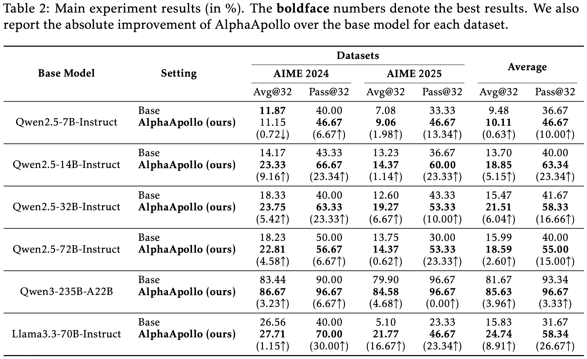
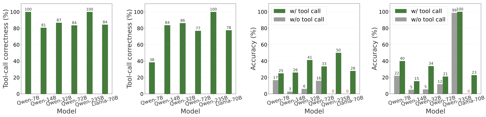
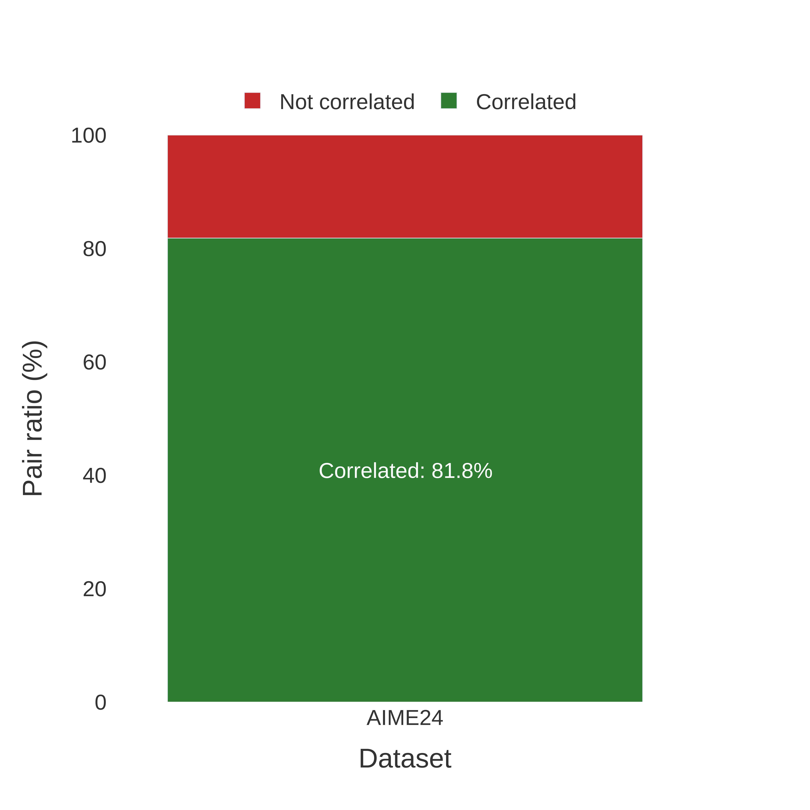
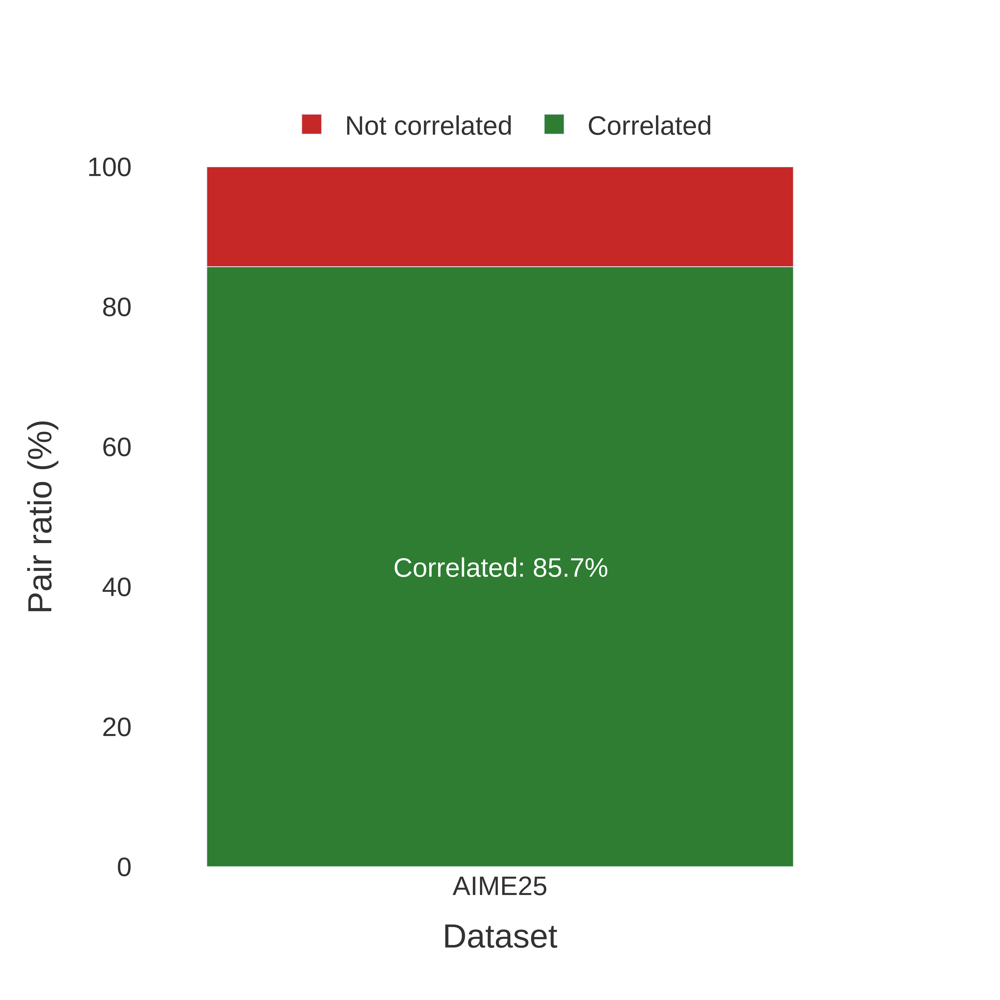
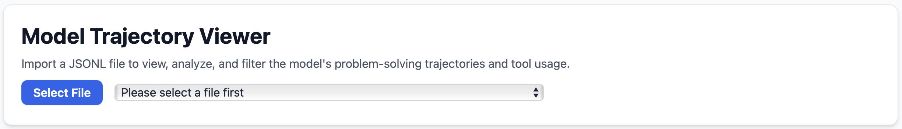
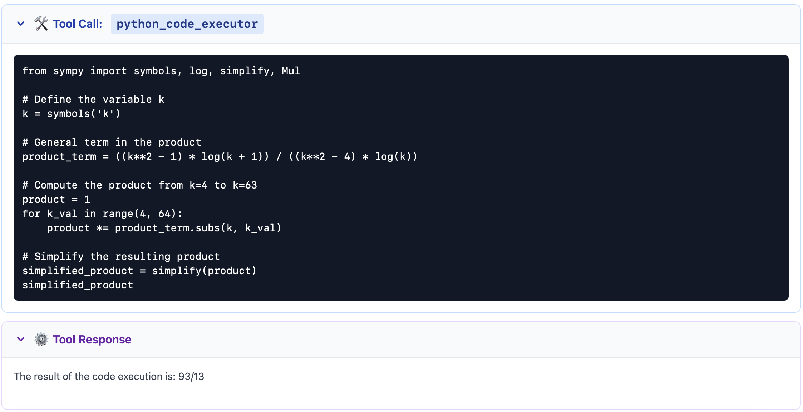
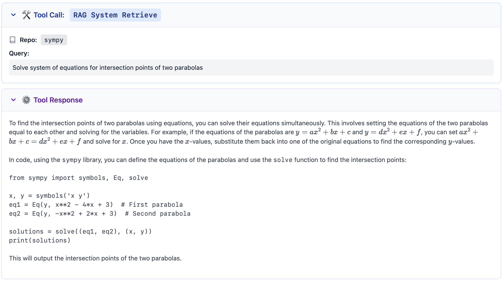

<div align="center">

<h2>AlphaApollo</h2>

<p>
<a href="https://arxiv.org/pdf/2510.06261">AlphaApollo: Orchestrating Foundation Models and Professional Tools into a Self-Evolving System for Deep Agentic Reasoning</a>
</p>

</div>

## Overview
We present AlphaApollo, a self-evolving agentic reasoning system that aims to address two bottlenecks in foundation model (FM) reasoning—limited model-intrinsic capacity and unreliable test-time iteration. 
AlphaApollo orchestrates multiple models with professional tools to enable deliberate, verifiable reasoning. It couples (i) a computation tool (Python with numerical and symbolic libraries) and (ii) a retrieval tool (task-relevant external information) to execute exact calculations and ground decisions. 
The system further supports multi-round, multi-model solution evolution via a shared state map that records candidates, executable checks, and feedback for iterative refinement. 

In evaluations on AIME 2024/2025 across multiple models, AlphaApollo delivers consistent gains: +5.15\% Average@32 and +23.34\% Pass@32 for Qwen2.5-14B-Instruct, and
+8.91\% Average@32 with +26.67\% Pass@32 for Llama-3.3-70B-Instruct.
Tool-use analysis shows that more than 80\% of tool calls are successfully executed, with consistent outperformance of non-tool baselines, thereby lifting the capability ceiling of FMs.

## News
- [2025/10/05]AlphaApollo-v1's tech report is released! See on [Arxiv](https://arxiv.org/pdf/2510.06261).


## Features

 - 🔧 MCP-driven rollout coordinates models and tools for tool-augmented reasoning.
 - 🧮 Computational module runs model-generated Python code with automatic error repair.
 - 📚 Retrieval module rewrites queries, retrieves relevant context, and summaries to guide computation.

## Main Results
- We evaluate Qwen2.5, Qwen3, and Llama families on AIME 2024/2025 with temperature 0.6, top-k 20, top-p 0.95, and 32 samples per question. Table shows consistent gains across families and scales: up to +9.16% Average@32 and +23.34% Pass@32 on Qwen2.5-14B/32B/72B-Instruct; steady improvements for Qwen3-235B-A22B; and on Llama3.3-70B-Instruct (AIME 2025) +16.67% Average@32 with Pass@32 rising from 23.33% to 46.67%.
<p align="center">
    
    <!-- Text. -->
</p>

- We analyze our system from two perspectives: tool-call quality and impact on final performance. We extract and validate tool responses to flag computation errors, nonexistent-package queries, and undefined-tool calls. As shown in Figure, more than 80% of tool calls are correct across models, indicating the framework reliably guides valid tool usage. As for impact, we partition outputs into with/without tools and compute per-question accuracies; Figure shows tool-assisted responses consistently outperform non-tool ones, enabling Qwen3-235B-A22B and Llama3.3-70B-Instruct to solve problems they otherwise miss, thus extending the capability frontier.
<p align="center">
    
    <!-- Text. -->
</p>

## Case Studies and Analysis
 - The Computational Module: We report the ratio of correct code versus code remaining unrepaired in the computational module (left: AIME24, right: AIME25). We observe that, by the end, nearly 90% of the Python code is correct.
<p align="center">
    
    
    <!-- Text. -->
</p>

- The Retrieval Module: We analyze the RAG–Python package overlap, measuring the correlation between packages retrieved by the RAG module and those actually used by subsequent Python code (left: AIME24, right: AIME25). We observe that over 80% of RAG queries align with the subsequent Python code.
<p align="center">
    
    
    <!-- Text. -->
</p>

- We provide several examples in `.jsonl` format under `results`. You could open `analysis/case_study.html` in a browser, click `Select File`, and select them to visualize the reasoning trajectories.
<p align="center">
    
    <!-- Text. -->
</p>

- Computational tool case: model-generated Python code and its execution result.
<p align="center">
    
    <!-- Text. -->
</p>

- Retrieval tool case: the rewritten query and the retrieved response.
<p align="center">
    
    <!-- Text. -->
</p>


## Citation

If you find this work useful, please cite the paper:
```bibtex
@article{zhou2025alphaapollo,
  title={AlphaApollo: Orchestrating Foundation Models and Professional Tools into a Self-Evolving System for Deep Agentic Reasoning},
  author={Zhou, Zhanke and Cao, Chentao and Feng, Xiao and Li, Xuan and Li, Zongze and Lu, Xiangyu and Yao, Jiangchao and Huang, Weikai and Xu, Linrui and Cheng, Tian and Jiang, Guanyu and Zheng, Yiming and Miranda, Brando and Liu, Tongliang and Koyejo, Sanmi and Sugiyama, Masashi and Han, Bo},
  journal={arXiv preprint arXiv:2510.06261},
  year={2025}
}
```